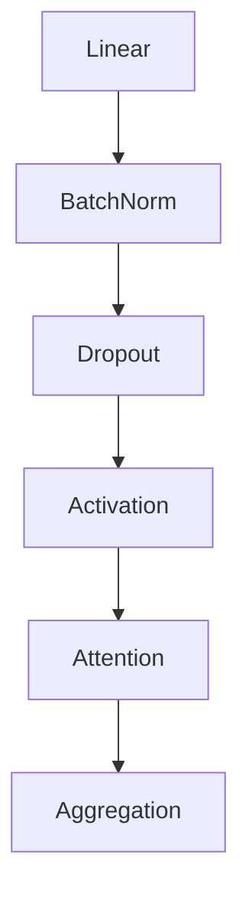

# Stanford CS224W: ML with Graphs | 2021

- 主页的 slide 是老的: https://web.stanford.edu/class/cs224w/
- 快照的 slide 反而新: https://snap.stanford.edu/class/cs224w-2023/

### Lecture 2.1 - Traditional Feature-based Methods: Node
- 传统图机器学习就是基于特征的方法，提取特征，然后用经典机器学习的方法训练和推理

Node 的特征：
- degree
- node centrality (eigen vector, #shortest path)
- cluster coefficient
- graphlet degree vector (GDV)

### Lecture 2.2 - Traditional Feature-based Methods: Link
link prediction as a task:
- links missing at random
- links over time

link prediction via proximity:
- [相似地址发现](240906_find_similar_erc20_usdt_addr_v001b.ipynb) 用的是这个方案

The text in the image reads:

**Link-Level Features: Overview**
- Distance-based feature (shortest-path)
- Local neighborhood overlap (Jaccard's coefficient 这个可以在查找币安相关地址上试试)
- Global neighborhood overlap （Katz Index）

### Lecture 2.3 - Traditional Feature-based Methods: Graph
- kernel methods (度量两个图的相似度)
  - graph kernels: graphlet kernel, Weisfeiler-Lehman kernel
  - node key idea: graph feature vector, like BOW (bag of words), such as bag-of-node, bag-of-node-degree
  - graphlet key idea: graphlet count vector, count graphlet 计算量太大 -> Weisfeiler-Lehman kernel
  - Weisfeiler-Lehman: color refinement; The WL kernel value is computed by the inner product of the color count vectors

**Graphlet Kernel**
- Graph is represented as *Bag-of-graphlets*
- *Computationally expensive*

**Weisfeiler-Lehman Kernel**
- Apply *K-step color refinement algorithm* to enrich node colors
  - Different colors capture different *K-hop neighborhood* structures
- Graph is represented as *Bag-of-colors*
- *Computationally efficient*
- Closely related to Graph Neural Networks (as we will see!)

### Lecture 2 Summary
**Traditional ML Pipeline**
- Hand-crafted feature + ML model

**Hand-crafted features for graph data**

- **Node-level:**
  - Node degree, centrality, clustering coefficient, graphlets

- **Link-level:**
  - Distance-based feature
  - local/global neighborhood overlap

- **Graph-level:**
  - Graphlet kernel, WL kernel

### Lecture 3.1 - Node Embeddings
- graph representation learning (no need feature engineering) -> feature representing (embedding)

embedding 可以用来
- Node classification
- Link prediction
- Graph classification
- Anomalous node detection

Encoder, Decoder

embedding similarity -> dot product of 2 vectors

How to choose node similarity measure? (by random walk (unsupervised/self-supervised))

### Lecture 3.2-Random Walk Approaches for Node Embeddings
预测 u 到达 v 的概率。是否能到达要看 random walk (u->v) 能不能走到

short fixed-length random walks -> multiset of visited nodes -> maximum likelihood of neighbors

tips:
- negative sampling k, prop to its degree, k = 5-20
- SGD

node2vec:
- biased random walk
- bfs(local view) or dfs (global view)
- p (return), q (in-out)

**Summary so far**

- **Core idea:** Embed nodes so that distances in embedding space reflect node similarities in the original network.
- **Different notions of node similarity:**
  - Naïve: similar if 2 nodes are connected
  - Neighborhood overlap (covered in Lecture 2)
  - Random walk approaches (covered today)
- **So what method should I use..?**
- No one method wins in all cases....
  - E.g., node2vec performs better on node classification while alternative methods perform better on link prediction (Goyal and Ferrara, 2017 survey)
- Random walk approaches are generally more efficient
- **In general:** Must choose definition of node similarity that matches your application!

### Lecture 3.3 - Embedding Entire Graphs

graph embedding:
- sum of all node embedding
- virtual node
- anonymous walk embedding: l-step anonymous walk count as graph vector, l = 7 need 122500 random walks
- learn embedding of anonymous walk: next walk can be predicted (like seq2seq predict next token)
  - output: walk embedding (z_i) and graph embedding (z_G)
  - z_G: 1. z_G1^T*z_G2 as kernel; 2. as input of downstream task
- hierarchical embedding: lecture 8

**How to Use Embeddings**

- **How to use embeddings $$z_i$$ of nodes**

  - **Clustering/community detection**: Cluster nodes
  - **Node classification**: Predict label of nodes
  - **Link prediction**: Predict edge $$(i, j)$$ based on:
    - Where we can: concatenate, avg, product, or distance between the embeddings:
      - Concatenate: $$f(z_i, z_j) = g([z_i, z_j])$$
      - Hadamard: $$f(z_i, z_j) = g(z_i * z_j)$$ (per coordinate product)
      - Sum/Avg: $$f(z_i, z_j) = g(z_i + z_j)$$
      - Distance: $$f(z_i, z_j) = g(||z_i - z_j||_2)$$
    - hadamard, sum/avg good for undirected graph
  - **Graph classification**: graph embeddings

Today's Summary

We discussed **graph representation learning**, a way to learn **node and graph embeddings** for downstream tasks, **without feature engineering**.

- **Encoder-decoder framework:**
  - Encoder: embedding lookup
  - Decoder: predict score based on embedding to match node similarity

- **Node similarity measure:** (biased) random walk
  - Examples: DeepWalk, Node2Vec

- **Extension to Graph embedding:** Node embedding aggregation and Anonymous Walk Embeddings

### Graph as Matrix: PageRank, Random Walks and Embeddings
### Lecture 4.1 - PageRank
graph as matrix

- Treating a graph as a matrix allows us to:
  - Determine node importance via random walk (PageRank)
  - Obtain node embeddings via matrix factorization (MF)
  - View other node embeddings (e.g. Node2Vec) as MF

- Random walk, matrix factorization and node embeddings are closely related!

PageRank
- web as graph

We will cover the following **Link Analysis approaches** to compute the **importance** of nodes in a graph:
- PageRank
- Personalized PageRank (PPR)
- Random Walk with Restarts

PageRank: The "Flow" Model
- page with more in-links is more important, in-link from important page count more (RECURSIVE)
- stochastic adjacency matrix M
  - *M* is a **column stochastic matrix**
  - Columns sum to 1
- rank vector r: r_i is importance score of page_i
- the flow equation: r = M * r

pagerank -> MF <- random walk

r is stationary distribution for the random walk,
like eigenvector of a matrix

flow equation <-> eigenvector formulation

PageRank = r is principal eigenvector of M with eigenvalue 1
Power iteration

**PageRank: Summary**

- **PageRank:**
  - Measures importance of nodes in a graph using the link structure of the web
  - Models a random web surfer using the stochastic adjacency matrix $$M$$
  - PageRank solves $$r = Mr$$ where $$r$$ can be viewed as both the principal eigenvector of $$M$$ and as the stationary distribution of a random walk over the graph

### Lecture 4.2 - PageRank: How to Solve?
initial -> repeat until convergence (power iteration, 50 iteration is enough)

2 problems:
- dead ends: 1.0 teleport prob
- spider traps: 1 - b to jump to random page b = 0.8, 0.9

PageRank equation [Brin-Page, 98]

$$r_j = \sum_{i \rightarrow j} \beta \frac{r_i}{d_i} + (1 - \beta) \frac{1}{N}$$

- The Google Matrix G:

  $$P = \beta M + (1 - \beta) \left[ \frac{1}{N} \right]_{N \times N}
  $$

  [1/N]_{N \times N}\) ... \(N\) by \(N\) matrix where all entries are \(1/N\)

- We have a recursive problem: $$ r = G \cdot r $$

**Solving PageRank: Summary**

- **PageRank** solves for \( r = Gr \) and can be efficiently computed by **power iteration of the stochastic adjacency matrix (G)**
- Adding random uniform teleportation solves issues of **dead-ends and spider-traps**

### Lecture 4.3 - Random Walk with Restarts
recommend problem

**PageRank:**
- Ranks nodes by "importance"
- Teleports with uniform probability to any node in the network

**Personalized PageRank:**
- Ranks proximity of nodes to the teleport nodes $$S$$

**Proximity on graphs:**
- **Q:** What is most related item to **Item Q?**
- **Random Walks with Restarts**
  - Teleport back to the starting node: $$S = \{Q\}$$

PR, PPR, random walk with restart, only diff of teleport:
- any
- a set of nodes
- a node

some node in query nodes get more importance if it was walked more times.

### Lecture 4.4 - Matrix Factorization and Node Embeddings

02-nodeemb.pdf: p61-p70

min A - Z^T * Z
factor matrix A to Z
Inner product decoder with node similarity defined by edge connectivity is equivalent to matrix factorization of 𝐴.

DeepWalk can also be explained as MF

limitation 1-3 of DeepWalk/node2vec

**Summary**

- **PageRank**
  - Measures importance of nodes in graph
  - Can be efficiently computed by power iteration of adjacency matrix

- **Personalized PageRank (PPR)**
  - Measures importance of nodes with respect to a particular node or set of nodes
  - Can be efficiently computed by random walk

- **Node embeddings** based on random walks can be expressed as matrix factorization

- **Viewing graphs as matrices plays a key role in all above algorithms!**

### Lecture 5.1 - Message passing and Node Classification

three old techniques which are helpful to new GNN:
- relational classification
- iterative classification
- belief propagation

[homophily](https://youtu.be/6g9vtxUmfwM?list=PLoROMvodv4rPLKxIpqhjhPgdQy7imNkDn&t=342): char -> conn
[influence](): conn -> char

collective classification:
- local
- relational
- collective inference

### Lecture 5.2 - Relational and Iterative Classification

- probabilistic relational classifier: a little similar to KNN
  - only label, not use node feature
- iterative
  - both of label and feature
  - example: web page classify

**Summary**

- We talked about 2 approaches to collective classification

- Relational classification
  - Iteratively update probabilities of node belonging to a label class based on its neighbors

- Iterative classification
  - Improve over collective classification to handle attribute/feature information
  - Classify node \(i\) based on its features as well as labels of neighbors

### Lecture 5.3 - Collective Classification: Belief Propagation
- loopy belief propagation
- message passing

$$
m_{i \to j}(Y_j) = \sum_{Y_i \in \mathcal{L}} \psi(Y_i, Y_j) \phi_i(Y_i) \prod_{k \in N_i \setminus \{j\}} m_{k \to i}(Y_i) \quad \forall Y_j \in \mathcal{L}
$$

- **Sum over all states**: $\sum_{Y_i \in \mathcal{L}}$
- **Label-label potential**: $\psi(Y_i, Y_j)$
- **Prior**: $\phi_i(Y_i)$
- **All messages sent by neighbors from previous round**: $\prod_{k \in N_i \setminus \{j\}} m_{k \to i}(Y_i)$

loop -> not converge -> but good for heuristic

**Advantages of Belief Propagation**

**Advantages:**
- Easy to program & parallelize
- General: can apply to any graph model with any form of potentials
  - Potential can be higher order: e.g. $$\psi(Y_i, Y_j, Y_k, Y_v \ldots)$$

**Challenges:**
- Convergence is not guaranteed (when to stop), especially if many closed loops

**Potential functions (parameters):**
- Require training to estimate

**Summary**

- We learned how to leverage correlation in graphs to make prediction on nodes
- Key techniques:
  - Relational classification
  - Iterative classification
  - Loopy belief propagation

### Lecture 6.1 - Introduction to Graph Neural Networks
recap
- limitations of shallow embedding

Tasks we will be able to solve:
- Node classification: Predict the type of a given node
- Link prediction: Predict whether two nodes are linked
- Community detection: Identify densely linked clusters of nodes
- Network similarity: How similar are two (sub)networks

### Lecture 6.2 - Basics of Deep Learning
https://snap.stanford.edu/class/cs224w-2023/slides/04-GNN1.pdf

**Summary**

- **Objective function:** 
  $$\min_\Theta \mathcal{L}(y, f(x))$$

- \( f \) can be a simple linear layer, an MLP, or other neural networks (e.g., a GNN later)
- Sample a minibatch of input \( x \)
- **Forward propagation:** compute \( \mathcal{L} \) given \( x \)
- **Back-propagation:** obtain gradient \( \nabla_\Theta \mathcal{L} \) using a chain rule
- Use **stochastic gradient descent (SGD)** to optimize for \( \Theta \) over many iterations

### Lecture 6.3 - Deep Learning for Graphs
https://snap.stanford.edu/class/cs224w-2023/slides/04-GNN1.pdf

- Permutation-invariant
- Permutation-equivariant

neighborhood aggregation
- sum or avg -> deep encoder

deepwalk/node2vec: shallow encoder

GCN: deep encoder

equation in matrix form
- neighbor agg
- self trans
- sparse matrix multiplication

here agg is sum/avg,
when aggregation function is complex, GNNs can not be expressed in matrix form

https://tkipf.github.io/graph-convolutional-networks/

inductive capability, generalize to unseen nodes. 
**That's it, now I can see the GCN example in PyG**

new nodes is not unseen nodes, need new embedding on the fly.

**Summary**
- **Recap:** Generate node embeddings by aggregating neighborhood information
  - We saw a basic variant of this idea
  - Key distinctions are in how different approaches aggregate information across the layers
- **Next:** Describe GraphSAGE graph neural network architecture

### Lecture 7.1 - A general Perspective on GNNs

GNN framework and how to design a GNN:

GCN, GraphSAGE, GAT difference is just on how to:
- Message
- Aggregation
AND
- Layer connectivity: simple stack or add skip
- Graph manipulation (feature augmentation, structure manipulation)
- objective function

### Lecture 7.2 - A Single Layer of a GNN
> @haongngoc1215
> This lecture is the best one in the whole series.

#### A Single GNN Layer

- **Idea of a GNN Layer:**
  - Compress a set of vectors into a single vector
  - **Two step process:**
    - (1) Message
    - (2) Aggregation

#### Message Computation
https://youtu.be/247Mkqj_wRM?list=PLoROMvodv4rPLKxIpqhjhPgdQy7imNkDn&t=164
- **(1) Message computation**
  
  - **Message function:** $$\mathbf{m}_u^{(l)} = \text{MSG}^{(l)} \left( \mathbf{h}_u^{(l-1)} \right)$$
    
    - *Intuition:* Each node will create a message, which will be sent to other nodes later
    
    - *Example:* A Linear layer $$\mathbf{m}_u^{(l)} = \mathbf{W}^{(l)} \mathbf{h}_u^{(l-1)}$$
      
      - Multiply node features with weight matrix $$\mathbf{W}^{(l)}$$

#### Message Aggregation

- **(2) Aggregation**
  - **Intuition:** Each node will aggregate the messages from node \( v \)'s neighbors
  - $$
    \mathbf{h}_v^{(l)} = \text{AGG}^{(l)} \left( \left\{ \mathbf{m}_u^{(l)}, u \in N(v) \right\} \right)
    $$
  - **Example:** Sum($\cdot$), Mean($\cdot$) or Max($\cdot$) aggregator
  - $$
    \mathbf{h}_v^{(l)} = \text{Sum}(\{\mathbf{m}_u^{(l)}, u \in N(v)\})
    $$

#### Message Aggregation: Issue

- **Issue**: Information from node $v$ itself **could get lost**
  - Computation of $h_v^{(l)}$ does not directly depend on $h_v^{(l-1)}$
  
- **Solution**: Include $h_v^{(l-1)}$ when computing $h_v^{(l)}$
  - **(1) Message**: compute message from node $v$ itself
    - Usually, a *different message computation* will be performed
    
    $$
    \mathbf{m}_u^{(l)} = \mathbf{W}^{(l)} \mathbf{h}_u^{(l-1)}
    $$

    $$
    \mathbf{m}_v^{(l)} = \mathbf{B}^{(l)} \mathbf{h}_v^{(l-1)}
    $$

  - **(2) Aggregation**: After aggregating from neighbors, we can **aggregate the message from node** $v$ **itself**
    - Via *concatenation* or *summation*

$$
h_v^{(l)} = \text{CONCAT}\left(\text{AGG}\left(\left\{\mathbf{m}_u^{(l)}, u \in N(v)\right\}\right), \mathbf{m}_v^{(l)}\right)
$$

#### A Single GNN Layer

- **Putting things together:**

  - **(1) Message:** each node computes a message
  
    $$ \mathbf{m}_u^{(l)} = \text{MSG}^{(l)} \left( \mathbf{h}_u^{(l-1)} \right), u \in \{N(v) \cup v\} $$
    
  - **(2) Aggregation:** aggregate messages from neighbors
  
    $$ \mathbf{h}_v^{(l)} = \text{AGG}^{(l)} \left( \{ \mathbf{m}_u^{(l)}, u \in N(v) \}, \mathbf{m}_v^{(l)} \right) $$
    
  - **Nonlinearity (activation):** Adds expressiveness
    - Often written as $\sigma(\cdot)$: ReLU($\cdot$), Sigmoid($\cdot$), ...
    - Can be added to **message** or **aggregation**

#### Classical GNN Layers: GCN (1)

- **(1) Graph Convolutional Networks (GCN)**

  $$
  \mathbf{h}_v^{(l)} = \sigma \left( \mathbf{W}^{(l)} \sum_{u \in N(v)} \frac{\mathbf{h}_u^{(l-1)}}{|N(v)|} \right)
  $$

- **How to write this as Message + Aggregation?**

  $$
  \mathbf{h}_v^{(l)} = \sigma \left( \sum_{u \in N(v)} \mathbf{W}^{(l)} \frac{\mathbf{h}_u^{(l-1)}}{|N(v)|} \right)
  $$
  
  Aggregation <- Message

#### Classical GNN Layers: GCN (2)

- **(1) Graph Convolutional Networks (GCN)**

  $$ \mathbf{h}_v^{(l)} = \sigma \left( \sum_{u \in N(v)} \mathbf{W}^{(l)} \frac{\mathbf{h}_u^{(l-1)}}{|N(v)|} \right) $$

- **Message:**
  - Each Neighbor: $$ \mathbf{m}_u^{(l)} = \frac{1}{|N(v)|} \mathbf{W}^{(l)} \mathbf{h}_u^{(l-1)} $$  _Normalized by node degree_ (In the GCN paper they use a slightly different normalization)

- **Aggregation:**
  - **Sum** over messages from neighbors, then apply activation
    $$ \mathbf{h}_v^{(l)} = \sigma \left( \textbf{Sum} \left( \{ \mathbf{m}_u^{(l)} , u \in N(v) \} \right) \right) $$ 

#### Classical GNN Layers: GraphSAGE

- **(2) GraphSAGE**

  $$\mathbf{h}_v^{(l)} = \sigma \left( \mathbf{W}^{(l)} \cdot \text{CONCAT} \left( \mathbf{h}_v^{(l-1)}, \text{AGG} \left( \{ \mathbf{h}_u^{(l-1)}, \forall u \in N(v) \} \right) \right) \right)$$

- **How to write this as Message + Aggregation?**
  - **Message** is computed within the AGG(·)
  - **Two-stage aggregation**
    - **Stage 1:** Aggregate from node neighbors
      $$\mathbf{h}_{N(v)}^{(l)} \leftarrow \text{AGG} \left( \{ \mathbf{h}_u^{(l-1)}, \forall u \in N(v) \} \right)$$
    - **Stage 2:** Further aggregate over the node itself
      $$\mathbf{h}_v^{(l)} \leftarrow \sigma \left( \mathbf{W}^{(l)} \cdot \text{CONCAT}(\mathbf{h}_v^{(l-1)}, \mathbf{h}_{N(v)}^{(l)}) \right)$$

#### GraphSAGE Neighbor Aggregation

- **Mean**: Take a weighted average of neighbors

  $$ \text{AGG} = \sum_{u \in N(v)} \frac{h_u^{(l-1)}}{|N(v)|} $$

  *Aggregation*  *Message computation*

- **Pool**: Transform neighbor vectors and apply symmetric vector function Mean(⋅) or Max(⋅)

  $$ \text{AGG} = \text{Mean}(\text{MLP}(h_u^{(l-1)}), \forall u \in N(v) ) $$

  *Aggregation*  *Message computation*

- **LSTM**: Apply LSTM to reshuffled of neighbors

  $$ \text{AGG} = \text{LSTM}([h_u^{(l-1)}, \forall u \in \pi(N(v))]) $$

  *Aggregation*  *Message computation* in LSTM

#### GraphSAGE: L2 Normalization
这好像也是在一些极端情况中 GraphSAGE 比 GCN 更稳定的原因，比如: usdt转账网络中有中心化交易所这种超级节点
- **$\ell_2$ Normalization:**
  - **Optional:** Apply $\ell_2$ normalization to $\mathbf{h}_v^{(l)}$ at every layer
  - $$\mathbf{h}_v^{(l)} \leftarrow \frac{\mathbf{h}_v^{(l)}}{\|\mathbf{h}_v^{(l)}\|_2} \quad \forall v \in V \quad \text{where} \quad \|u\|_2 = \sqrt{\sum_i u_i^2} \, (\ell_2\text{-norm})$$
  - Without $\ell_2$ normalization, the embedding vectors have different scales ($\ell_2$-norm) for vectors
  - In some cases (not always), normalization of embedding results in performance improvement
  - After $\ell_2$ normalization, all vectors will have the same $\ell_2$-norm

#### Classical GNN Layers: GAT (1)

- (3) Graph Attention Networks
  $$ \mathbf{h}_v^{(l)} = \sigma \left( \sum_{u \in N(v)} \alpha_{vu} \mathbf{W}^{(l)} \mathbf{h}_u^{(l-1)} \right) $$
  *Attention weights*

- In GCN / GraphSAGE
  - $ \alpha_{vu} = \frac{1}{|N(v)|} $ is the **weighting factor (importance)** of node $u$'s message to node $v$
  - $\Rightarrow \alpha_{vu}$ is defined *explicitly* based on the *structural properties* of the graph (node degree)
  - $\Rightarrow$ All neighbors $u \in N(v)$ are equally important to node $v$

#### Classical GNN Layers: GAT (2)

- **(3) Graph Attention Networks**

$$
\mathbf{h}_v^{(l)} = \sigma \left( \sum_{u \in N(v)} \alpha_{vu} \mathbf{W}^{(l)} \mathbf{h}_u^{(l-1)} \right)
$$
_Attention weights_

- **Not all node’s neighbors are equally important**
  - **Attention** is inspired by cognitive attention.
  - The attention $$\alpha_{vu}$$ focuses on the important parts of the input data and fades out the rest.
    - _Idea:_ the NN should devote more computing power on that small but important part of the data.
    - Which part of the data is more important depends on the context and is learned through training.

#### Graph Attention Networks

**Can we do better than simple neighborhood aggregation?**

**Can we let weighting factors $\alpha_{vu}$ to be learned?**

- **Goal:** Specify *arbitrary importance* to different neighbors of each node in the graph
- **Idea:** Compute embedding $h_v^{(l)}$ of each node in the graph following an *attention strategy:*
  - Nodes attend over their neighborhoods' message
  - Implicitly specifying different weights to different nodes in a neighborhood

#### Attention Mechanism (1)

- Let $\alpha_{vu}$ be computed as a byproduct of an **attention mechanism** $a$:
  - (1) Let $a$ compute **attention coefficients** $e_{vu}$ across pairs of nodes $u$, $v$ based on their messages:
    $$e_{vu} = a(W^{(l)} h_u^{(l-1)}, W^{(l)} h_v^{(l-1)})$$
    - $e_{vu}$ indicates the importance of $u$'s message to node $v$

$$e_{AB} = a(W^{(l)} h_A^{(l-1)}, W^{(l)} h_B^{(l-1)})$$

#### Attention Mechanism (2)

- **Normalize** $e_{vu}$ into the *final attention weight* $\alpha_{vu}$
  - Use the **softmax** function, so that $\sum_{u \in N(v)} \alpha_{vu} = 1$:

  $$\alpha_{vu} = \frac{\exp(e_{vu})}{\sum_{k \in N(v)} \exp(e_{vk})}$$

- **Weighted sum** based on the *final attention weight* $\alpha_{vu}$

  $$\mathbf{h}_v^{(l)} = \sigma \left( \sum_{u \in N(v)} \alpha_{vu} \mathbf{W}^{(l)} \mathbf{h}_u^{(l-1)} \right)$$

**Weighted sum using** $\alpha_{AB}, \alpha_{AC}, \alpha_{AD}$:

$$\mathbf{h}_A^{(l)} = \sigma (\alpha_{AB} \mathbf{W}^{(l)} \mathbf{h}_B^{(l-1)} + \alpha_{AC} \mathbf{W}^{(l)} \mathbf{h}_C^{(l-1)} + \alpha_{AD} \mathbf{W}^{(l)} \mathbf{h}_D^{(l-1)})$$

#### Attention Mechanism (3)

- **What is the form of attention mechanism $a$?**
  - The approach is agnostic to the choice of $a$
    - E.g., use a simple single-layer neural network
    - $a$ have trainable parameters (weights in the Linear layer)

    $$
    e_{AB} = a \left( W^{(l)} h_A^{(l-1)}, W^{(l)} h_B^{(l-1)} \right) = \text{Linear} \left( \text{Concat} \left( W^{(l)} h_A^{(l-1)}, W^{(l)} h_B^{(l-1)} \right) \right)
    $$

  - Parameters of $a$ are trained jointly:
    - Learn the parameters together with weight matrices (i.e., other parameter of the neural net $W^{(l)}$) in an end-to-end fashion

#### Attention Mechanism (4)
> multi-head 的就像模型融合导致结果更稳健，每个 head
> 局部最优，融合后更稳健。
- 🔹 **Multi-head attention:** Stabilizes the learning process of attention mechanism
- 🔹 **Create multiple attention scores** (each replica with a different set of parameters):

  $$ \mathbf{h}_v^{(l)}[1] = \sigma \left( \sum_{u \in N(v)} \alpha_{vu}^1 \mathbf{W}^{(l)} \mathbf{h}_u^{(l-1)} \right) $$

  $$ \mathbf{h}_v^{(l)}[2] = \sigma \left( \sum_{u \in N(v)} \alpha_{vu}^2 \mathbf{W}^{(l)} \mathbf{h}_u^{(l-1)} \right) $$

  $$ \mathbf{h}_v^{(l)}[3] = \sigma \left( \sum_{u \in N(v)} \alpha_{vu}^3 \mathbf{W}^{(l)} \mathbf{h}_u^{(l-1)} \right) $$

- 🔹 **Outputs are aggregated:**

  - By concatenation or summation

  $$ \mathbf{h}_v^{(l)} = \text{AGG} \left( \mathbf{h}_v^{(l)}[1], \mathbf{h}_v^{(l)}[2], \mathbf{h}_v^{(l)}[3] \right) $$

#### Benefits of Attention Mechanism

- **Key benefit**: Allows for (implicitly) specifying **different importance values** ($\alpha_{vu}$) **to different neighbors**

- **Computationally efficient**:
  - Computation of attentional coefficients can be parallelized across all edges of the graph
  - Aggregation may be parallelized across all nodes

- **Storage efficient**:
  - Sparse matrix operations do not require more than $$O(V + E)$$ entries to be stored
  - **Fixed** number of parameters, irrespective of graph size

- **Localized**:
  - Only **attends over local network neighborhoods**

- **Inductive capability** (可理解为可迁移性):
  - It is a shared **edge-wise** mechanism
  - It does not depend on the global graph structure

#### GAT Example: Cora Citation Net

| Method                               | Cora  |
|--------------------------------------|-------|
| MLP                                  | 55.1% |
| ManiReg (Belkin et al., 2006)        | 59.5% |
| SemiEmb (Weston et al., 2012)        | 59.0% |
| LP (Zhu et al., 2003)                | 68.0% |
| DeepWalk (Perozzi et al., 2014)      | 67.2% |
| ICA (Lu & Getoor, 2003)              | 75.1% |
| Planetoid (Yang et al., 2016)       | 75.7% |
| Chebyshev (Defferrard et al., 2016)  | 81.2% |
| GCN (Kipf & Welling, 2017)           | 81.5% |
| **GAT**                              | **83.3%** |

- **improvement w.r.t GCN**: 1.8%

> Attention mechanism can be used with many different graph neural network models

> In many cases, attention leads to performance gains

- **t-SNE plot of GAT-based node embeddings**:
  - Node color: 7 publication classes
  - Edge thickness: Normalized attention coefficients between nodes $i$ and $j$, across eight attention heads, $\Sigma_k (\alpha^k_{ij} + \alpha^k_{ji})$

#### GNN Layer in Practice

- **In practice, these classic GNN layers are a great starting point**
  - We can often get better performance by **considering a general GNN layer design**
  - Concretely, we can **include modern deep learning modules** that proved to be useful in many domains
  
  Transformation:
  - Linear
  - BatchNorm
  - Dropout
  - Activation
  - Attention
  - Aggregation

A suggested GNN Layer

#### GNN Layer in Practice
J. You, R. Ying, J. Leskovec: [Design Space of Graph Neural Networks](...), NeurIPS 2020

- **Many modern deep learning modules can be incorporated into a GNN layer**
- **Batch Normalization:**
  - Stabilize neural network training
- **Dropout:**
  - Prevent overfitting
- **Attention/Gating:**
  - Control the importance of a message
- **Skip Connection**
- **More:**
  - Any other useful deep learning modules

#### Batch Normalization

- **Goal:** Stabilize neural networks training
- **Idea:** Given a batch of inputs (node embeddings)
  - Re-center the node embeddings into zero mean
  - Re-scale the variance into unit variance

**Input:** $X \in \mathbb{R}^{N \times D}$  
$N$ node embeddings

**Trainable Parameters:** $\gamma, \beta \in \mathbb{R}^{D}$

**Output:** $Y \in \mathbb{R}^{N \times D}$  
Normalized node embeddings

##### Step 1:
**Compute the mean and variance over** $N$ **embeddings**

$$
\mu_j = \frac{1}{N} \sum_{i=1}^{N} x_{i,j}
$$

$$
\sigma_j^2 = \frac{1}{N} \sum_{i=1}^{N} (x_{i,j} - \mu_j)^2
$$

##### Step 2:
**Normalize the feature using computed mean and variance**

$$
\hat{x}_{i,j} = \frac{x_{i,j} - \mu_j}{\sqrt{\sigma_j^2 + \epsilon}}
$$

$$
y_{i,j} = \gamma_j \hat{x}_{i,j} + \beta_j
$$

#### Dropout

- **Goal**: Regularize a neural net to prevent overfitting.
- **Idea**:
  - **During training**: with some probability $p$, randomly set neurons to zero (turn off)
  - **During testing**: Use all the neurons for computation

#### Dropout for GNNs

- In GNN, Dropout is applied to **the linear layer in the message function**
  - A simple message function with linear layer: $\mathbf{m}_u^{(l)} = \mathbf{W}^{(l)} \mathbf{h}_u^{(l-1)}$

#### Activation (Non-linearity)

Apply activation to $i$-th dimension of embedding $x$

- **Rectified linear unit (ReLU)**
  - $\text{ReLU}(x_i) = \max(x_i, 0)$
    - Most commonly used

- **Sigmoid**
  - $\sigma(x_i) = \frac{1}{1 + e^{-x_i}}$
    - Used only when you want to restrict the range of your embeddings

- **Parametric ReLU**
  - $\text{PReLU}(x_i) = \max(x_i, 0) + a_i \min(x_i, 0)$
    - $a_i$ is a trainable parameter
    - Empirically performs better than ReLU

#### GNN Layer in Practice

- **Summary**: Modern deep learning modules can be included into a GNN layer for better performance

- **Designing novel GNN layers is still an active research frontier!**

- **Suggested resources**: You can explore diverse GNN designs or try out your own ideas in [GraphGym](#)

content of the above little part:
1. Graph Convolutional Networks (GCN)
2. GraphSAGE
3. Graph Attention Networks (GAT)

### Lecture 7.3 - Stacking layers of a GNN
https://www.youtube.com/watch?v=ew1cnUjRgl4

#### Stacking GNN Layers

- **How to construct a Graph Neural Network?**
  - *The standard way:* Stack GNN layers sequentially
  - **Input:** Initial raw node feature $x_v$
  - **Output:** Node embeddings $h_v^{(L)}$ after $L$ GNN layers

#### The Over-smoothing Problem
> 这是为什么GNN的层数少，不像CNN那样多
- **The Issue of stacking many GNN layers**
  - GNN suffers from **the over-smoothing problem**
- **The over-smoothing problem**: all the node embeddings converge to the same value
  - This is bad because we **want to use node embeddings to differentiate nodes**
- **Why does the over-smoothing problem happen?**

#### Receptive Field of a GNN

- **Receptive field**: the set of nodes that determine the embedding of a node of interest
- **In a $K$-layer GNN, each node has a receptive field of $K$-hop neighborhood**

  - Receptive field for  
    **1-layer GNN**

  - Receptive field for  
    **2-layer GNN**

  - Receptive field for  
    **3-layer GNN**

- **Receptive field overlap** for two nodes

  - **The shared neighbors quickly grows** when we increase the number of hops (num of GNN layers)

    - **1-hop neighbor overlap**  
      Only 1 node
    
    - **2-hop neighbor overlap**  
      About 20 nodes

    - **3-hop neighbor overlap**  
      Almost all the nodes!

#### Receptive Field & Over-smoothing

- **We can explain over-smoothing via the notion of receptive field**
  - We knew **the embedding of a node is determined by its** _receptive field_
    - If two nodes _have highly-overlapped receptive fields, then their embeddings are highly similar_

  - _Stack many GNN layers_ $\Rightarrow$ _nodes will have highly-overlapped receptive fields_ $\Rightarrow$ _node embeddings will be highly similar_ $\Rightarrow$ _suffer from the over-smoothing problem_

- **Next:** how do we overcome the over-smoothing problem?

#### Design GNN Layer Connectivity

- **What do we learn from the over-smoothing problem?**
- **Lesson 1: Be cautious when adding GNN layers**
  - Unlike neural networks in other domains (CNN for image classification), **adding more GNN layers do not always help**
  - **Step 1:** Analyze the necessary receptive field to solve your problem. E.g., by computing the diameter of the graph
  - **Step 2:** Set number of GNN layers $L$ to be a bit more than the receptive field. **Do not set $L$ to be unnecessarily large!**

- **Question:** How to enhance the expressive power of a GNN, **if the number of GNN layers is small?**

#### Expressive Power for Shallow GNNs (1)

- **How to make a shallow GNN more expressive?**
- **Solution 1:** Increase the expressive power *within each GNN layer*
  - In our previous examples, each transformation or aggregation function only include one linear layer
  - We can **make aggregation / transformation become a deep neural network!**

#### Expressive Power for Shallow GNNs (2)

- **How to make a shallow GNN more expressive?**
- **Solution 2**: Add layers that do not pass messages
  - A GNN does not necessarily only contain GNN layers
  - E.g., we can add **MLP layers** before and after GNN layers, as **pre-process layers** and **post-process layers**

**Pre-process layers**: Important when encoding node features is necessary.  
E.g., when nodes represent images/text

**Post-process layers**: Important when reasoning/transformation over node embeddings are needed  
E.g., graph classification, knowledge graphs

In practice, adding these layers works great!

#### Design GNN Layer Connectivity

- **What if my problem still requires many GNN layers?**
- **Lesson 2: Add skip connections in GNNs**

  - **Observation from over-smoothing:** Node embeddings in earlier GNN layers can sometimes better differentiate nodes
  - **Solution:** We can increase the impact of earlier layers on the final node embeddings, **by adding shortcuts in GNN**

- **Idea of skip connections:**
  - Before adding shortcuts:
    $$F(x)$$
  - After adding shortcuts:
    $$F(x) + x$$

#### Idea of Skip Connections

- **Why do skip connections work?**
  - **Intuition:** Skip connections create **a mixture of models**
  - $N$ skip connections $\rightarrow 2^N$ possible paths
  - Each path could have up to $N$ modules
  - We automatically get **a mixture of shallow GNNs and deep GNNs**

  **All the possible paths:** for 3-layer-GNN has, 
  $2 \times 2 \times 2 = 2^3 = 8$

#### Example: GCN with Skip Connections

- A standard GCN layer

  $$\mathbf{h}_v^{(l)} = \sigma \left( \sum_{u \in N(v)} \mathbf{W}^{(l)} \frac{\mathbf{h}_u^{(l-1)}}{|N(v)|} \right)$$

  This is our $F(x)$

- A GCN layer with skip connection

  $$\mathbf{h}_v^{(l)} = \sigma \left( \sum_{u \in N(v)} \mathbf{W}^{(l)} \frac{\mathbf{h}_u^{(l-1)}}{|N(v)|} + \mathbf{h}_v^{(l-1)} \right)$$

  $F(x) + x$

#### Other Options of Skip Connections

- **Other options:** Directly skip to the last layer
  - The final layer directly **aggregates from the all the node embeddings** in the previous layers

$$ \begin{align*}
\text{Input: } & \, h_v^{(0)} \\
& \, \text{GNN Layer} \\
& \, h_v^{(1)} \\
& \, \text{GNN Layer} \\
& \, h_v^{(2)} \\
& \, \text{GNN Layer} \\
& \, h_v^{(3)} \\
& \, \text{Layer aggregation} \\
& \, \text{Concat/Pooling/LSTM} \\
\text{Output: } & \, h_v^{(\text{final})} \\
\end{align*} $$

### Lecture 8.1 - Graph Augmentation for GNNs

## reference
- [video](https://www.youtube.com/playlist?list=PLoROMvodv4rPLKxIpqhjhPgdQy7imNkDn)
- [pyg](https://pytorch-geometric.readthedocs.io/en/latest/get_started/introduction.html)
- [pyg colabs](https://pytorch-geometric.readthedocs.io/en/latest/get_started/colabs.html)